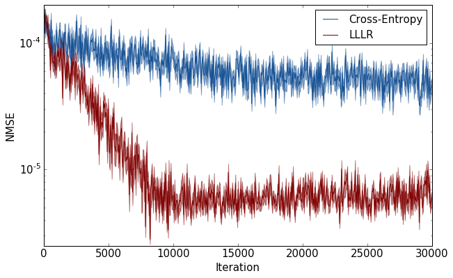

# LLLR: Toy-model

In this article, we test whether the proposed LLLR can help a neural network estimating the true log-likelihood ratio. The inputs and networks are simplified to multidimensional Gaussian random variables and a 3-layer fully-connected network with nonlinear activation, respectively.

A simple 3-layer fully connected network performing the density ratio estimation using the loss for log-likelihood ratio estimation (LLLR).

The structure of this project is inherited from [the SPRT-TANDEM code](https://github.com/TaikiMiyagawa/SPRT-TANDEM).  

## Experimental Settings
Our experimental settings are based on Sugiyama et al. 2008, "Direct importance estimation for covariate shift adaptation":

Let $p_0(x)$ be the $d$-dimensional Gaussian density with mean $(a, 0, 0, ..., 0)$ and covariance identity, and $p_1(x)$ be the $d$-dimensional Gaussian density with mean $(0, a, 0, ..., 0)$ and covariance identity. 

The task for the neural network is to estimate the density ratio:

$\hat{r}(x) = \frac{\hat{p}_1(x)}{\hat{p}_0(x)}$.

Here, $x$ is sampled either from $p_0$ or $p_1$. We compared 3 loss functions: (1) KLIEP, (2) LLLR, and (3) cross-entropy loss.

## Tested Environment
- Python 3.5
- tensorflow 2.0.0
- CUDA 10.0
- cuDNN 7.6.4.38

## Tutorial 
To train the MLP, use train_MLP.py. To change parameters including weights for the LLLE and CE-loss, modify .yaml files under the config folder.  

To visualize the example results, use example_results/plot_example_runs.ipynb. Also see the plot below.

## Example Results
The MLP was trained either with the LLLR or CE-loss, repeated 56 times with different random initial vairables. The plot below shows the mean NMSE with the shading shows standard error of the mean.


## Reference
[1] Sugiyama, M.; Suzuki, T.; Nakajima, S.; Kashima, H.; von Bünau, P.; Kawanabe, M. Direct Importance Estimation for Covariate Shift Adaptation. Ann Inst Stat Math 2008, 60 (4), 699–746. https://doi.org/10.1007/s10463-008-0197-x.

## Citation
___Please cite our paper if you use the whole or a part of our codes.___
```
Bibtex:

@misc{SPRT_TANDEM2020,
    title={Deep Neural Networks for the Sequential Probability Ratio Test on Non-i.i.d. Data Series},
    author={Akinori F. Ebihara and Taiki Miyagawa and Kazuyuki Sakurai and Hitoshi Imaoka},
    year={2020},
    eprint={2006.05587},
    archivePrefix={arXiv},
    primaryClass={cs.LG}
}

```
